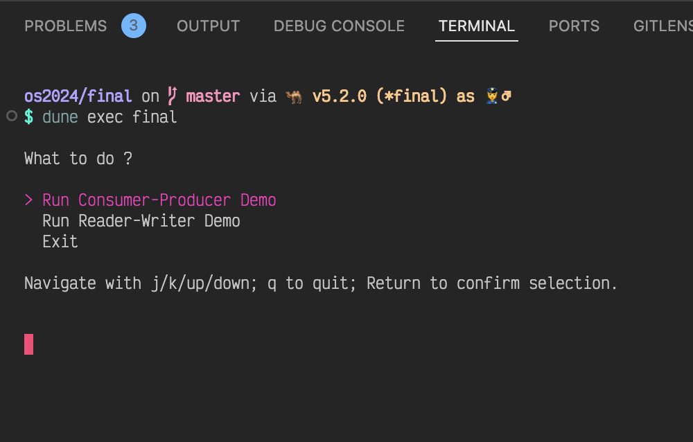
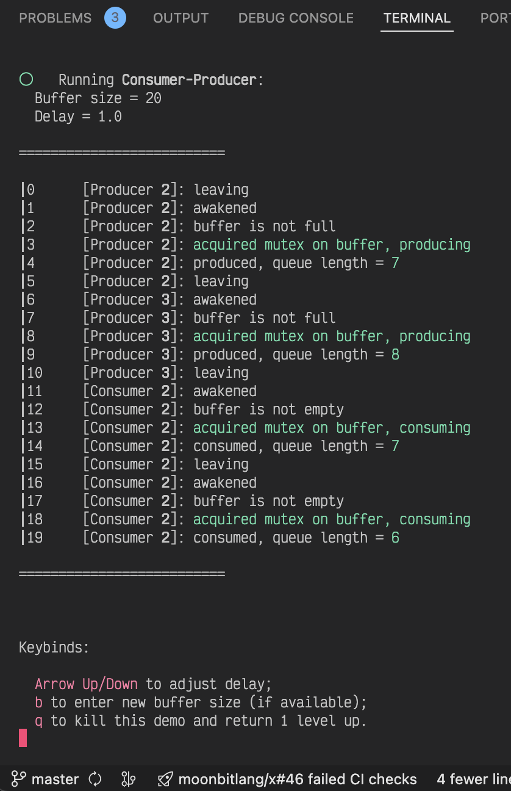
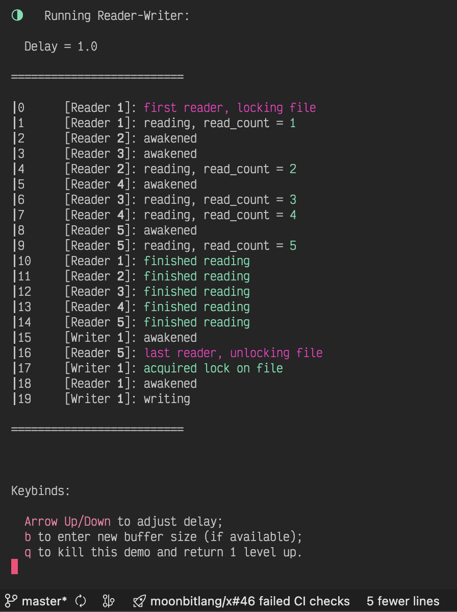

# 课程设计报告

## 概述

主要完成的任务是任务 2 **进程同步算法**, 主要解决了以下几个问题:

- 在只有原生 Monitor 支持的语言下实现 Semaphore
- 利用自己实现的 Semaphore 实现**生产者-消费者**和**读者-写者**问题
- 实现简易的 TUI (和 GUI 稍有不同, TUI 指在终端中绘制的图形界面).

## 总体设计

本项目使用 OCaml 语言, 该语言在程序语言设计与实现 (PLDI) 领域最为学界常用,
我根据个人研究方向选择自己最熟练的语言, 选择了 OCaml.
自行实现语言中没有的信号量功能, 进而解决上述进程同步问题.
界面设计上, 采用函数式的 [Elm Architecture](https://guide.elm-lang.org/architecture/):

- 用一个数据结构 `Model` 表示程序的每一个状态;
- 一个函数 `view` 将每个状态转换成为终端的 UI 界面;
- 一个函数 `update` 完成程序状态的转换. (每一帧)

由于 TUI 本身是独立于我们的两个进程同步问题的, 所以这之间亦有并发代码参与.
我选择了 OCaml 的 Actor Model (演员模型) 库 [Riot](https://github.com/riot-ml/riot),
Actor Model 是一种函数式语言常用的并发编程范式, 该范式指出 _一切(对象)皆是演员_:

- 演员是一个运算实体, 响应接收到的消息, 相互间是并发的, 演员可以:

  - 发送有限数量的消息给其他演员
  - 创建有限数量的新演员
  - 指定接收到下一个消息时要用到的行为.

上述叙述中并不涉及先后顺序, 因此可以并行进行. 这样就有了并发的基础. 这种编程范式在 Erlang 和 Rust 中经常使用.

## 项目文件结构

代码中, 核心代码的注释为中文; 除此之外的注释为英文.

```plaintext
.
├── Makefile
├── bin
│   ├── dune
│   └── main.ml                        TUI, 主程序部分代码
├── demo.mp4                           演示视频
├── dune-project
├── final-linux-amd64-musl-static      Linux 可执行文件
├── final-osx-aarch64                  macOS 可执行文件
├── final.md
├── final.opam
├── report.pdf                         课程设计报告
└── lib
    ├── Makefile
    ├── cp_sem.ml                      生产者-消费者实现
    ├── dune
    ├── rw_sem.ml                      读者-写者实现
    ├── sem.ml                         信号量实现
    ├── sem.mli
    ├── tuiconf.ml                     杂项工具函数
    └── tuiconf.mli
```

## 详细设计

秉着不重复造轮子的过程, 我使用了数个库, 简化开发:

- OCaml 标准库: 数组, 队列, 管程
- [Minttea](https://github.com/leostera/minttea): TUI 组件库, 用于实现界面
- [Riot](https://github.com/riot-ml/riot): Actor Model 并发库, 用于界面绘制和主程序的独立执行

> 由于微软借着其 Windows 的垄断地位, 藐视国际标准 POSIX, 导致 Riot 库中所用到的一些 POSIX syscall (`poll.h`) 没有 Windows 实现 (MinGW 的实现是半残的). 因此我没有办法在 Windows 上编译出可执行文件. 我主要使用 macOS 和 Linux, 会提交 macOS (arm64) 和 Linux (amd64) 的可执行文件. 在 Windows 下, 请考虑使用 WSL 运行. 为了方便, 除运行截图之外我亦会提交一个演示视频.

### 核心问题说明

#### 实现信号量

由于 OCaml 只提供了原生的管程支持, 我们必须要使用管程来实现信号量.

首先考虑一个数据结构, 其至少包含一个 `int`, 这是信号量的最基本要求. 为了保证信号量操作的原子性, 需要使用管程的互斥锁 `Mutex`. 回忆信号量的性质, 可以知道, 当值为正时, 线程可以执行, 否则会被阻塞. 因此还需要一个管程的条件 `Condition` 来记录信号量值的正负. 这样, 信号量可以表示为:

```ocaml
(** Using native monitors to implement semaphores.
    @param x value of a semaphore

    @param mutex : ensure the atomicity of any semaphore operation

    @param x_positive : Condition on whether x is positive *)
type semaphore =
  { mutable x : int
  ; mutex : Mutex.t
  ; x_positive : Condition.t
  }
type t = semaphore
```

接下来, 需要实现信号量的 `P` `V` 操作和信号量的构造函数. 回忆管程的 `wait` `signal` 操作, 它们和 `P` `V` 操作其实十分近似, 可以考虑用这两个操作实现 `P` `V`.

- 构造函数 `mk`: 显然信号量不能用负值初始化, 因此加一判定条件, 若为负则报错.
- `V`: V 操作可以增加一个资源, 信号量值应当增加 1. 这可用管程的 `signal` 操作实现.
- `P`: P 操作告诉我们, 当信号量为负值时应该阻塞当前线程; 同时 P 操作会消耗一个资源, 信号量值应当减少 1. 这可以用管程的 `wait` 操作实现. (为了保证 `V` 的 `signal` 操作不会在信号量为负的前提下唤醒某个线程, 将 `wait` 套在一个 `while` 循环中)
- `P` `V` 操作都修改了信号量, 为了保证原子性, 这些修改操作都应该加锁, 这一点通过管程的 `lock/unlock` 操作实现.

经过这样的分析, 我们可以为上面的 `semaphore` 类型实现 `p_op` `v_op` 方法:

```ocaml
module Sem = struct
  let mk x =
    if x < 0
    then invalid_arg "semaphore must be initialized w/ non-negatives"
    else { x; mutex = Mutex.create (); x_positive = Condition.create () }
  ;;

  let p_op s =
    match s with
    | { mutex; x_positive; _ } ->
      let open Mutex in
      let open Condition in
      (* r/w on semaphore should be atomic*)
      lock mutex;
      while s.x = 0 do
        (* wait until semaphore is positive *)
        wait x_positive mutex
      done;
      s.x <- s.x - 1;
      unlock mutex
  ;;

  let v_op s =
    match s with
    | { mutex; x_positive; _ } ->
      let open Mutex in
      let open Condition in
      lock mutex;
      s.x <- s.x + 1;
      (* A positive semaphore means there are resources left. Signal a thread *)
      signal x_positive;
      unlock mutex
  ;;

  let ( ~+ ) = v_op
  let ( ~- ) = p_op
end
```

同时为了方便, 我们用算符 `~+/~-` (unary +/-) 表示信号量的 `P` `V` 操作.

这样我们就解决了第一个问题: 如何实现信号量.

#### 生产者-消费者问题

由于我们实现了一个标准的 Semaphore, 接下来实现生产者-消费者问题就很简单.

生产者-消费者问题解决的主要思路是:

> 设置同步锁确保生产者/消费者之一独占缓冲区; 设置互斥锁确保同时只有一个生产者/消费者能够修改缓冲区. 同步锁须在互斥锁之前上, 在其之后释放, 否则可能造成死锁.

同步锁可以设置两个记录型信号量: `empty_slots` `full_slots` 表示缓冲区空位和占位数. 两者一个赋缓冲区长度, 另一赋 `0`; 互斥锁 `buffer_mutex = 1`; 缓冲区可以用队列实现. 这样, 实现如下:

(下面的代码是 `cp_sem.ml` 的精简版)

```ocaml
open Thread
open Sem

(** 共享缓冲区大小. 10 ~ 50 *)
let buffer_size = ref @@ Random.int_in_range ~min:10 ~max:50
(** 共享缓冲区, 用队列模拟 *)
let buffer = Queue.create ()
(** 缓冲区互斥锁, 某一时刻只能有一个生产者/消费者修改缓冲区 *)
let buffer_mutex = Sem.mk 1
let exiting = ref false
(** 记录型信号量: 表示缓冲区有多少空位可供生产者用于生产, 是同步锁 *)
let empty_slots = Sem.mk !buffer_size
(** 记录型信号量: 表示缓冲区有多少位置可供消费者消费, 是同步锁 *)
let full_slots = Sem.mk 0
(* 这里我们设置 empty_slots = n; full_slots = 0, 表明缓冲区一开始没有任何产品, 因此生产者最先运行. 而反过来设置 `(empty_slots, full_slots) = 0, n` 也是可以的. *)

let rec producer id =
  if !exiting
  then raise Thread.Exit
  else (
    let item = [%string "item_#$(id)"] in
    let open Sem in
    (* 先后对同步锁, 互斥锁上锁, 表示生产者对缓冲区的独占. 反过来会造成死锁. *)
    ~-empty_slots;
    ~-buffer_mutex;
    (* 模拟生产者生产 *)
    Queue.add item buffer;
    (* 生产完毕, 先后释放互斥锁, 同步锁 *)
    ~+buffer_mutex;
    ~+full_slots;
    (producer [@tailcall]) @@ id)
;;

let rec consumer id =
  if !exiting
  then raise Thread.Exit
  else
    let open Sem in
    (* 表示消费者对缓冲区的独占. *)
    ~-full_slots;
    ~-buffer_mutex;
    (* 模拟消费者消费 *)
    Queue.take buffer |> ignore;
    (* 消费完毕 *)
    ~+buffer_mutex;
    ~+empty_slots;
    (consumer [@tailcall]) @@ id
;;
```

函数式语言通常喜欢用递归, 而不用迭代. 这里我们用 `let rec` binding 定义两个递归函数 `producer` `consumer` 并指派给生产者/消费者线程跑 (等效课本代码的 `while true`).  
说到递归, 需要注意的问题就是**爆栈**:

> 迭代伴随着副作用 (side effects), 每次迭代过程中状态的转换是通过修改变量的值实现的. 任何时刻只有一个状态, 空间复杂度 $O(1)$.
>
> 而递归则不是, 递归的状态来自于函数签名 (signature) 中的参数, 通过传参实现状态转换. 每一个状态的参数和调用本身都被保存在 call stack 中 (用于回溯). 这导致空间复杂度变为 $O(n)$. 因而深度过大的递归会造成调用栈的溢出. 而尾递归不必回溯. 其思想上等于迭代, 因而可以通过编译器在 IR 层面做优化降低空间复杂度.

上面的函数是 tail-recursion (尾递归). 函数出口只有两个: `Thread.Exit` 或者递归调用. 前者直接使得当前线程跳出函数, 终止执行, 后者在函数尾部, 因而满足尾递归的条件. 我们在函数尾部的递归调用处加一个 pragma `[@tailcall]` 显式地告诉编译器做尾递归优化. 这样对 call stack 的空间复杂度能从原来的 $O(n)$ 降低到 $O(1)$, 不会导致 stack overflow.

这样, 我们实现了一个运行可靠的生产者消费者问题.

#### 读者-写者问题

这里只解决第一类读者写者问题, 即课本上所谓写者可能饥饿.

首先认识到, 读者/写者之间应该是互斥的. 一个文件的临界区段 (Critical Section) 在某一时刻只能被读者或写者其中之一独占. 为此, 可以定义一个文件锁 (互斥锁) `resource_access = 1`.

- 同时只能有一个写者写文件.
- 而对读者而言则可以同时有多个读者读取同一个文件. 那么写者如何能知道所有的读者都读取完毕 ?

可以设置一个计数器 `read_count = 0` 表示当前有多少个读者在读文件, 当该值为 0, 表明写者可以写文件. 显然该对该计数器的修改也应该是原子性的. 故而需要第二个互斥锁 `read_mutex = 1`.

在这里, 我们不使用可重入锁 `ReentrantLock`, 表明锁只能加一次. 因而需要判定何时上文件锁 `resource_access`:

```ocaml
if read_count = 1 then lock resource_access; (* 当第一个读者开始读时 *)
...
if read_count = 0 then unlock resource_access; (* 当最后一个读者读完时 *)
```

这样, 我们解决了写者的饥饿问题, 可以实现读者写者:

```ocaml
open Thread
open Sem

(** 表示当前正在读取文件的读者数目. 对这个变量的操作须是原子性的 *)
let read_count = ref 0
(** 读者互斥锁, 对上面 [read_count] 的原子操作通过加这个锁实现 *)
let read_mutex = Sem.mk 1
(** 文件锁(也是互斥锁), 某一时刻内只能有读者/写者其中之一访问文件.
    同时只能有一个写者或多个读者访问文件. *)
let resource_access = Sem.mk 1
(** 线程延迟时间, 用于调整程序执行速度 *)
let delay_snd = ref 1.0
(** 控制线程是否退出 *)
let exiting = ref false

let rec reader id =
  if !exiting
     (* OCaml 只允许结束当前线程 (即不能从一个线程结束其他的线程),
        通过设置 `exiting` flag 实现这一点 *)
  then raise Thread.Exit
  else
    let open Sem in
    (* 加读者锁以便原子性修改 `read_count` *)
    ~-read_mutex;
    (* 关于 `read_count` 的原子性操作需要在读者锁内进行 *)
    read_count := !read_count + 1;
    if !read_count = 1
       (* 如果是第一个访问文件的读者, 则加文件锁.
          表示读者对文件的独占访问. 之后的读者可跳过这一步. *)
    then
      ~-resource_access;
    (* 对 `read_count` 的修改结束, 释放读者锁 *)
    ~+read_mutex;
    (* 这里的 `delay` 模拟读取所消耗的时间, 此时可以存在一个或多个读者读取文件 *)
    delay !delay_snd;
    (* 读完文件, 需要再次加读者锁, 修改 `read_count -= 1`, 表示读者减少了一个 *)
    ~-read_mutex;
    read_count := !read_count - 1;
    if !read_count = 0 (* 如果是最后一个读完的读者, 需要释放文件锁, 以便写者写文件 *)
    then
      ~+resource_access;
    ~+read_mutex;
    (reader [@tailrec]) @@ id
;;

let rec writer id =
  if !exiting
  then raise Thread.Exit
  else
    let open Sem in
    (* 加文件锁, 表示写者对文件的独占访问 *)
    ~-resource_access;
    (* 模拟写文件 *)
    delay !delay_snd;
    (* 文件写完, 释放文件锁 *)
    ~+resource_access;
    (writer [@tailrec]) @@ id
;;
```

这样, 我们实现了读者-写者问题.

## 运行截图与数据分析验证



<center><b>主界面</b>: (j/k/up/down) 移动光标; q 退出程序; Enter 选择</center>



<center><b>生产者-消费者 Demo</b>: (up/down) 调整速度; q 返回主界面; b 调整缓冲区大小; 缓冲区滚动展示</center>

缓冲区上限 20, 当前大小 6, 图中经历了 `P2 -> P3 -> C2 -> C2`, 手推结果如下:

| P2                     | P3                     | C2                     | C2                     |
| ---------------------- | ---------------------- | ---------------------- | ---------------------- |
| 唤醒                   | 唤醒                   | 唤醒                   | 唤醒                   |
| 判定: 缓冲区不满       | 判定: 缓冲区不满       | 判定:缓冲区不空        | 判定: 缓冲区不空       |
| 生产, 产品数量 + 1 = 7 | 生产, 产品数量 + 1 = 8 | 消费, 产品数量 - 1 = 7 | 消费, 产品数量 - 1 = 6 |
| 生产完毕, 转 P3        | 生产完毕, 转 C2        | 消费完毕, 转 C2        | 消费完毕...            |

可以发现, 这和我们程序输出的 Log 是一样的. 说明实现无误.



<center><b>读者-写者 Demo</b>: (up/down) 调整速度; q 返回主界面</center>

图中经历了 `(R1, R2, R3, R4, R5) -> W1`, 给定条件 R1 是第一个读者, 手推结果:

为了方便, 首先定义几个记号表示操作 (BNF):

```bnf
op ::=
     | reading
     | writing;

lr ::= lock read_count
     , read_count | += 1
                  | -= 1
     , unlock read_count;

lf ::= lock file;
uf ::= unlock file;

lo ::= lf, op;
ou ::= uf, op;
```

因为此处 R1...R5 属于并发, 用一个类似 Gantt 图来表示这之间的流水线过程:

```plaintext
T   0    1    2    3    4    5    6    7    8    9
R1  | lr | lo | uf | lr |    |    |    |    |    |
R2            | lr | op | lr |    |    |    |    |
R3                 | lr | op | lr |    |    |    |
R4                      | lr | op | lr |    |    |
R5                           | lr | ou | lr |    |
W1                                     | lf | op | ...
```

特别注意 R1,R5. 我们手推发现, 这两个线程分别是最先/最后读取文件的, 所以要执行文件加锁/解锁操作 (`lf` `uf`). 查看图中 Log 发现与手推结果一致, 证明实现没有问题.

## 编译运行

根目录下运行:

```bash
# 安装依赖
opam switch create .
# 编译
dune build --release
# 编译并运行
dune exec final
```

可以在生成的目录 `_build/default/bin` 下找到二进制产物 `main.exe`

- 至此, 我们完全地完成了课题 2.

## 总结

经过本次实验, 我的编程技术得到了提高, 也对进程同步问题有了更深入的了解. 在实际应用中, 学会使用并发编程是一件很重要的技能, 我想本次实验在实际意义上也是很有用的.
