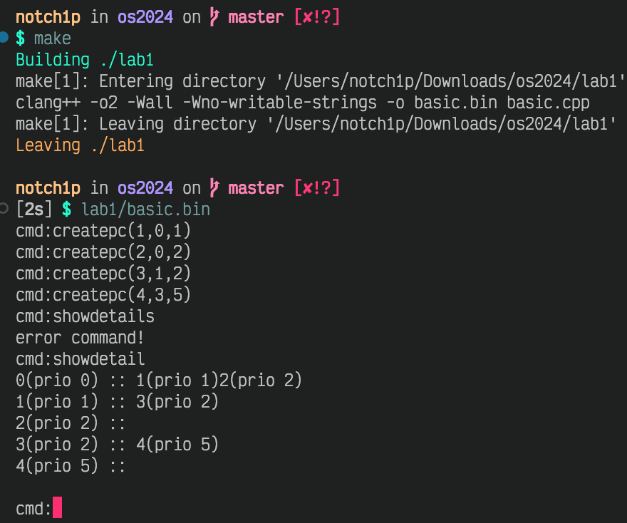

## Lab1

### 我查到的 dos 命令

CMD built-in commands are:

| Command      | Description                                                   |
| ------------ | ------------------------------------------------------------- |
| ASSOC        | Show or modify file extension associations                    |
| ATTRIB       | Show or change DOS file attributes                            |
| CALL         | Invoke a batch file from inside another                       |
| CD (CHDIR)   | Change current default directory                              |
| CHOICE       | Wait for an keypress from a selectable list                   |
| CLS          | Clear the console screen                                      |
| COPY         | Copy file                                                     |
| CTTY         | Change input/output device                                    |
| DATE         | Show or change the system date                                |
| DEL (ERASE)  | Delete a file or set of files                                 |
| DIR          | List the contents of a directory                              |
| ECHO         | Copy text directly to the console output                      |
| ENDLOCAL     | End localization of environment changes in a batch file       |
| FTYPE        | Show or modify open commands associated with file types       |
| HELP         | Show brief help details on a topic                            |
| MD (MKDIR)   | Create a subdirectory                                         |
| MKLINK       | Create a symbolic link                                        |
| MORE         | Display output in pages                                       |
| MOVE         | Move a file, set of files or directory tree                   |
| PATH         | Set or show the search path                                   |
| PAUSE        | Suspend execution of a batch file                             |
| POPD         | Restore the directory to the last one saved with PUSHD        |
| PROMPT       | Change the command prompt                                     |
| PUSHD        | Change to a new directory, saving the current one             |
| REN (RENAME) | Rename a file                                                 |
| RD (RMDIR)   | Delete a subdirectory                                         |
| SET          | Set or show environment variables                             |
| SETLOCAL     | Start localization of environment changes in a batch file     |
| START        | Start a program, or open a document in the associated program |
| TIME         | Set or show the current system time                           |
| TITLE        | Set the window title for the CMD session                      |
| TYPE         | Type the contents of a text file                              |
| VER          | Show the current version of CMD                               |
| VOL          | Show the volume label of a disk device                        |
| XCOPY        | Copy source files or directory trees to a destination         |
| EXIT         | Close down CMD                                                |

### msconfig

- boot


- services


- startup programs


### 修改 Registry...

#### ...以更换主页

（只有 IE 等读取这一注册表条目的部分浏览器会生效）

```cmd
reg add "HKEY_CURRENT_USER\Software\Microsoft\Internet Explorer\Main" /v "Start Page" /t REG_SZ /d
"https://www.scnu.edu.cn" /f
```

#### ...以删除自启动程序

```cmd
reg delete "HKEY_CURRENT_USER\Software\Microsoft\Windows\CurrentVersion\Run" /v %PROGRAM% /f
```

where the variable `PROGRAM` being the name of some program.

### 模拟进程树



向代码中添加了一些注释和 assertion，减少了一些不必要的代码，降低 runtime cost

- basic.h

```c
#ifndef basic_h
#include <assert.h>
#include <stdio.h>
#include <stdlib.h>
#include <string.h>
#define basic_h
char* errormsg[256];
// process control block
struct pcb {
    int pid; // process id
    int ppid; // parent process id
    int prio; // priority
    int state; // state
    int lasttime; // last execute time
    int tottime; // totle execute time
};
// process node tree
struct pnode {
    pcb* node;
    pnode* sub;
    pnode* brother;
    pnode* next;
};
// 信号量
struct semphore {
    char name[5]; // 名称
    int count; // 计数值
    int curpid; // 当前进程id
    pnode* wlist; // 等待链表
};
#define geterror(eno) printf("%s\n", errormsg[eno])

void initerror()
{
    // errormsg[0] = (char*)malloc(20);
    errormsg[0] = "error command!";
    // errormsg[1] = (char*)malloc(20);
    errormsg[1] = "error parameter!";
}
// get a substring in string s
char* substr(char* s, int start, int end)
{
    char* s1;
    int len = strlen(s);
    if (start < 0 || end >= len || start > end)
        return NULL;
    s1 = (char*)malloc(end - start + 2);
    int i;
    for (i = 0; i <= end - start; i++)
        s1[i] = s[i + start];
    s1[i] = '\0';
    return s1;
}
// find the location of c in string s
int instr(char* s, char c)
{
    size_t i;
    for (i = 0; i < strlen(s); i++)
        if (s[i] == c)
            return i;
    return -1;
}
// parse comma delimited string to array
int* strtoarray(char* s)
{
    int *a, count, x1;
    unsigned int i;
    char c, *s1, *s2;
    if (!s) {
        printf("string can't be null!\n");
        return NULL;
    }
    count = 0;
    s1 = s;
    assert(s1);
    for (i = 0; i < strlen(s1); i++)
        if (s1[i] == ',')
            count++;
    count++;
    a = (int*)malloc(count);
    c = ',';
    for (i = 0; i < count; i++) {
        x1 = instr(s1, c);
        if (x1 >= 0)
            s2 = substr(s1, 0, x1 - 1);
        else
            s2 = s1;
        a[i] = atoi(s2);
        if (c == ',')
            s1 = substr(s1, x1 + 1, strlen(s1) - 1);
    }
    return a;
}
#endif
```

- basic.cpp

```c
#include "basic.h"
pnode* proot; // system process tree root
pnode* plink; // system process link head
// create process
int createpc(int* para)
{
    // add your code here
    pnode *p, *p1, *pp;
    int pflag;
    pflag = 0;
    assert(para != NULL);
    for (p = plink; p; p = p->next) {
        if (p->node->pid == para[0]) // check if this pid is already exist
        {
            printf("pid %d is already exist!\n", para[0]);
            return -1;
        }
        if (p->node->pid == para[1]) // find parent pcb
        {
            pflag = 1;
            pp = p;
        }
    }
    if (!pflag) {
        printf("parent id %d is not exist!\n", para[1]);
        return -2;
    }
    // init new pcb
    p1 = new pnode;
    p1->node = new pcb;
    p1->node->pid = para[0];
    p1->node->ppid = para[1];
    p1->node->prio = para[2];
    p1->sub = NULL;
    p1->next = NULL;
    p1->brother = NULL;
    // add to process tree
    if (!pp->sub)
        pp->sub = p1;
    else {
        for (p = pp->sub; p->brother; p = p->brother)
            ;
        p->brother = p1;
    }
    // add to process link
    for (p = plink; p->next; p = p->next)
        ;
    p->next = p1;
    return 0;
}
// show process detail
void showdetail()
{
    // add your code here
    pnode *p, *p1;
    p = plink;
    for (; p;) // print all pcb info
    {
        printf("%d(prio %d) :: ", p->node->pid, p->node->prio);
        p1 = p->sub;
        for (; p1;) // print sub pcb
        {
            printf("%d(prio %d)", p1->node->pid, p1->node->prio);
            p1 = p1->brother;
        }
        printf("\n");
        p = p->next;
    }
    printf("\n");
}
// don't change
int main()
{
    initerror();
    short cflag, pflag;
    char cmdstr[32];
    proot = new pnode;
    proot->node = new pcb;
    // init root pcb and root process
    // used as the parent of all process
    proot->node->pid = 0;
    proot->node->ppid = -1;
    proot->node->prio = 0;
    proot->next = NULL;
    proot->sub = NULL;
    proot->brother = NULL;
    plink = proot;
    for (;;) {
        cflag = 0;
        pflag = 0;
        printf("cmd:");
        scanf("%s", cmdstr);
        if (!strcmp(cmdstr, "exit")) // exit the program
            break;
        if (!strcmp(cmdstr, "showdetail")) { // show details of all process
            cflag = 1;
            pflag = 1;
            showdetail();
        } else {
            int* para;
            char *s, *s1;
            s = strstr(cmdstr, "createpc"); // create process
            if (s) {
                cflag = 1;
                para = (int*)malloc(3);
                // getparameter
                s1 = substr(s, instr(s, '(') + 1, strlen(s) - 2); // get param string
                para = strtoarray(s1); // get parameter
                createpc(para); // create process
                pflag = 1;
            }
        }
        if (!cflag)
            geterror(0);
        else if (!pflag)
            geterror(1);
    }
}
```
