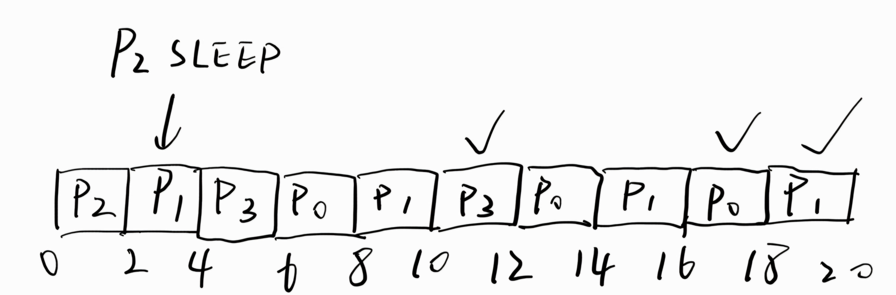
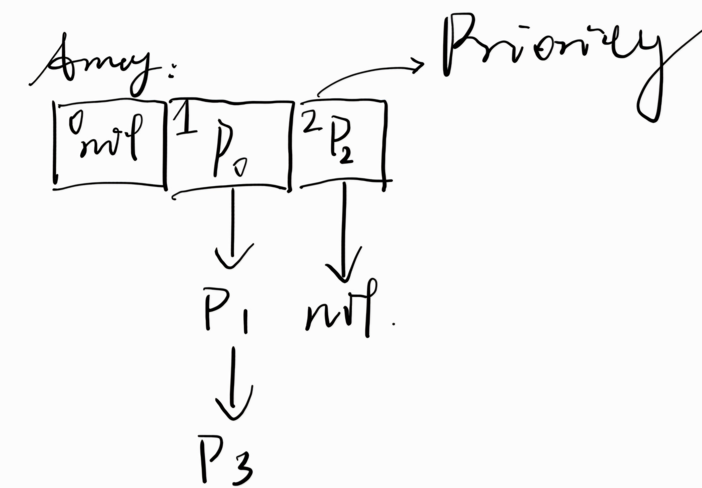

## Lab2

### 实验结果分析

- 复杂度分析

根据要求, 在代码中, 每个进程的状态（就绪; 运行; 阻塞）会在其运行时随机发生阻塞. 只有前两个状态的进程能够有机会获得时间片.
根据要求, 我们增加了对前两个状态的进程进行随机阻塞的功能. 理想情况下我们认为 `rand()` 是均匀分布的, 因而阻塞的概率是 $\frac{1}{2}$, 不阻塞的概率是 $\frac{1}{2}$.

优先级即权重,不影响复杂度.

复杂度主要发生在队列的操作部分. 代码中的队列是用链表实现的, 因而插入操作是 $O(n)$ 的.
无论进程是什么状态, 都要对其进行遍历操作, 所以也是 $O(n)$. 其他操作可在 $O(1)$ 内完成.
则复杂度是 $O(n)$. 如果队列使用数组实现, 则复杂度为 $O(1)$.

显然空间复杂度即队列长度 $O(n)$.

- 结果分析

考虑创建的四个线程, 时间片为 2:

```plaintext
id:0,state:0,pior:1,life:6
id:1,state:0,pior:1,life:7
id:3,state:0,pior:1,life:4
id:2,state:0,pior:2,life:6
```

分析可知, 理想情况下 $P_0, P_1, P_2, P_3$ 各需 `3, 4, 3, 2` 个时间片才能全部运行完毕.

实际运行的 Gantt 图如下所示:

可以发现 $P_2$ 因为遇上中断而被阻塞, 不能完成任务.

### 思考题

- 数据结构

因为优先级只有三个, 所以排序的时候采用了取巧的办法.
直接开一个大小为 3 的数组分别存放各个优先级的进程队列.
相同优先级的进程在队列中的顺序则是按照执行 `create` 产生 (即创建时的) 的顺序.
仍然看上面的例子, 画出数据结构如下:


- 增加随机中断功能

可以用判断奇偶的方法随机确定是否中断一个进程, 如果发生中断则再次调度 (即再次调用 `routine()`):

(同时还额外增加一个随机唤醒阻塞进程的功能)

```c
    // simulate when a interruption occurs
    int interrupt = rand() & 1;
    if (interrupt) {
        printf("interrupt occurs for process = %d\n", r->ident);
        // change state to blocked
        sleep(r->ident);
        printf("attemping to run RR scheduling again...\n");
        routine();
        return;
    } else if (r->state == 2) {
        printf("recovered from interruption for process = %d\n", r->ident);
        awake(r->ident);
        routine();
        return;
    }
```

这一实现的缺点在于, 本质上对 `routine()` 的调用是递归的, 且不是 tail-recursive 的,
如果进程队列庞大, 则会爆 call stack.

### 完整代码

```c
#include <stdio.h>
#include <stdlib.h>
#include <time.h>
// #include <dos.h>
#include <string.h>

// 定义进程数
#define LEN 10
// 定义最高优先级
#define MAXPIOR 3
// 定义时间片
#define QUANTUM 2
#define PCB sizeof(struct pcb)

struct pcb // PCB
{
    int ident; // 标识符
    int state; // 状态 0-就绪，1－运行，2－堵塞
    int pior; // 优先级,MAXPIOR为最高优先级*/
    int life; // 生命期*/
    struct pcb* next; /*指针*/
}* array[MAXPIOR];

static int idlist[LEN]; /*标识符表*/
int life = 0; /*总生命期初始化为0*/
char str[20];
char command[7][10];
int killtest = 0;
void init();
int create();
void kill(int x);
void process();
void routine();
void ps();

void init()
{
    int i = 0;
    for (i = 0; i < MAXPIOR; i++)
        array[i] = NULL;
    sprintf(command[0], "quit");
    sprintf(command[1], "ps");
    sprintf(command[2], "create");
    sprintf(command[3], "kill");
    sprintf(command[4], "round");
    sprintf(command[5], "sleep");
    sprintf(command[6], "awake");
}

int create()
{
    int i = 0, pior = 0;
    struct pcb *p, *q, *s;
    while (idlist[i] != 0 && i <= LEN - 1)
        i++;
    if (i == LEN)
        return -1;
    idlist[i] = 1;
    srand((unsigned)time(NULL));
    pior = rand() % MAXPIOR; // 最大优先级设定为0－2的整数
    // printf("pior=%d\n",pior);
    s = (struct pcb*)malloc(PCB); // create a node to keep the process messege
    s->ident = i;
    s->state = 0;
    s->pior = pior;
    s->life = 1 + rand() % 10; // 进程有生命期假设为1－20
    s->next = NULL;
    life = life + (s->life);

    p = array[pior]; // 建立同优先级队列（链表）
    if (p == NULL)
        array[pior] = s;
    else {
        while (p != NULL) {
            q = p;
            p = p->next;
        }
        q->next = s;
    }
    printf("success create process id=%d, current process state disp below:\n", s->ident);
    ps();
    // printf("end display\n");
    return 1;
}

void ps()
{
    int i = 0;
    struct pcb* p;
    for (i = 0; i < MAXPIOR; i++) {
        p = array[i];
        while (p != NULL) {
            printf("id:%d,state:%d,pior:%d,life:%d\n", p->ident, p->state, p->pior, p->life);
            p = p->next;
        }
    }
}

void sleep(int x)
{
    int i = 0, test = 0;
    struct pcb *p = NULL, *q = NULL;
    while (test == 0 && i != MAXPIOR) {
        p = array[i];
        if (i != MAXPIOR && p == NULL) {
            i++;
            continue;
        }
        while (p != NULL) {
            if (p->ident == x) {
                test = 1;
                killtest = 1;
                break;
            } else {
                q = p;
                p = p->next;
            }
        }
        if (test == 0)
            i++;
    } /*找到X所在指针*/
    if (i == MAXPIOR)
        printf("Invaild process number.");
    else if (p->state == 2)
        printf("the process %d has blocked,cannot sleep again!", p->ident);
    else
        p->state = 2;
    ps();
}

void awake(int x)
{
    int i = 0, test = 0;
    struct pcb *p = NULL, *q = NULL;
    while (test == 0 && i != MAXPIOR) {
        p = array[i];
        if (i != MAXPIOR && p == NULL) {
            i++;
            continue;
        }
        while (p != NULL) {
            if (p->ident == x) {
                test = 1;
                killtest = 1;
                break;
            } else {
                q = p;
                p = p->next;
            }
        }
        if (test == 0)
            i++;
    } /*找到X所在指针*/
    if (i == MAXPIOR)
        printf("Invaild process number.");
    else if (p->state == 0)
        printf("the process %d is ready state,cannot awake again!", p->ident);
    else
        p->state = 0;
    ps();
}

void kill(int x)
{
    int i = 0, test = 0;
    struct pcb *p = NULL, *q = NULL;
    while (test == 0 && i != MAXPIOR) {
        p = array[i];
        if (i != MAXPIOR && p == NULL) {
            i++;
            continue;
        }
        while (p != NULL) {
            if (p->ident == x) {
                test = 1;
                killtest = 1;
                break;
            } else {
                q = p;
                p = p->next;
            }
        }
        if (test == 0)
            i++;
    } /*找到X所在指针*/
    if (i == MAXPIOR)
        printf("Invaild process number.");
    else {
        if (p == array[i]) {
            array[i] = array[i]->next;
            idlist[x] = 0;
            free(p);
        } else {
            q->next = p->next;
            idlist[x] = 0;
            life = life - (p->life);
            free(p);
        }
    }
}

void process() // 对输入命令的处理
{
    int i = 0, ii = 0;
    for (i = 0; i < 7; i++)
        if (strcmp(str, command[i]) == 0)
            break;
    switch (i) {
    case 0:
        printf("thank you for using the program!\n");
        exit(0);
        break;
    case 1:
        ps();
        break;
    case 2:
        create();
        break;
    case 3: {
        printf("Which process you want to kill?\n");
        scanf("%d", &ii);
        kill(ii);
        break;
    }
    case 4:
        routine();
        break;
    case 5:
        printf("Which process you want to sleep?\n");
        scanf("%d", &ii);
        sleep(ii);
        break;
    case 6:
        printf("Which process you want to awake?\n");
        scanf("%d", &ii);
        awake(ii);
        break;

    default:
        printf("Error command.Please input create, ps, kill,sleep,awake,quit\n");
    }
}

void routine() // 执行一次调度运行，将最高优先级队列的进程运行1个时间片，并降低其优先级
{
    int i = MAXPIOR - 1, pior = 0, t;
    struct pcb *pp, *qq, *pr, *r;
    do {
        while (i >= 0 && array[i] == NULL)
            i--;
        if (i < 0) {
            printf("NO process,please create it! \n");
            return;
        }
        pr = r = array[i];
        while (r != NULL && r->state != 0) {
            pr = r;
            r = r->next;
        }
        i--;
    } while (r == NULL); // 从高优先队列中寻找就绪进程以调度它

    printf("The one in the hightest piror process will execute 1 quantum.\n");
    printf("process id=%d is running...", r->ident);
    // sleep(2);
    

    // simulate when a interruption occurs
    int interrupt = rand() & 1;
    if (interrupt) {
        printf("interrupt occurs for process = %d\n", r->ident);
        // change state to blocked
        sleep(r->ident);
        printf("attemping to run RR scheduling again...\n");
        routine();
        return;
    } else if (r->state == 2) {
        printf("recovered from interruption for process = %d\n", r->ident);
        awake(r->ident);
        routine();
        return;
    }
    
    r->state = 1; // 进程处于运行状态
    printf("end,change to ready state\n");
    r->pior = (r->pior) / 2;
    r->state = 0; // 进程处于就绪状态
    if (r->life - QUANTUM > 0) {
        r->life = r->life - QUANTUM; // 时间减少QUANTUM
        life = life - QUANTUM;
    } else {
        life = life - r->life;
        r->life = 0;
    }

    if (r->life == 0) // 进程运行完成，KILL它
    {
        printf("the process %d is successful run,and release it!\n", r->ident);
        kill(r->ident);
    } else {
        if (pr == r) // 将r结点从原队列中删除
            array[i + 1] = r->next;
        else
            pr->next = r->next;

        t = r->pior; // 将r进程加入到相应低优先级队列中的最后
        pp = array[t];
        qq = NULL;
        while (pp != NULL) {
            qq = pp;
            pp = pp->next;
        }
        if (qq == NULL) // 插入到队尾
            array[t] = r;
        else
            qq->next = r;
        r->next = NULL;
    }
    printf("after...\n");
    ps();

    printf("\n 1 quantum successful run!\n");
}

//**********************************
int main()
{
    init();
    printf("Welcome to the Process Scheduling system. This program simulate the Round-Robin with piror Scheduling alogrithm. \n");
    printf("c:\\>");
    scanf("%s", str);
    process();

    while (strcmp(str, "quit") != 0) {
        printf("\nc:\\>");
        scanf("%s", str);
        process();
    }
    return 0;
}
```