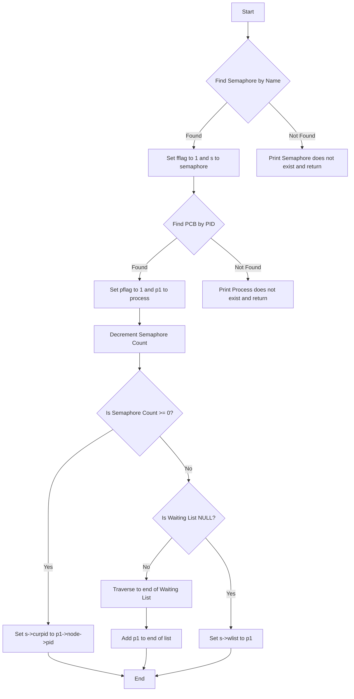
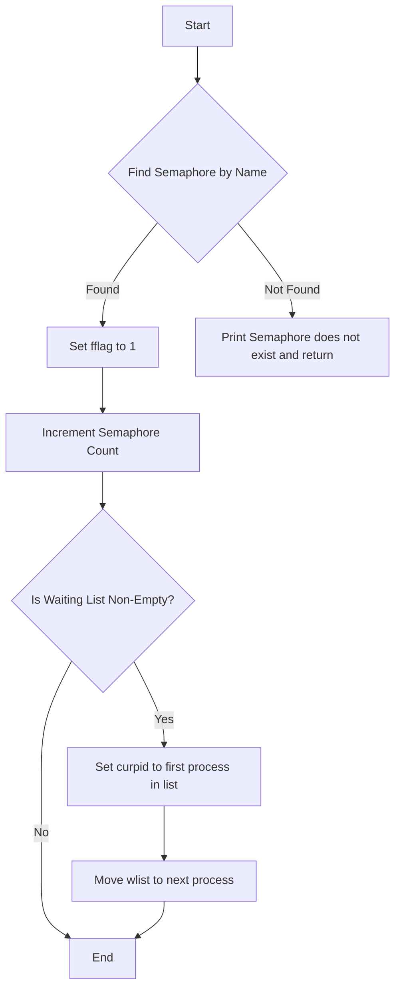

# Lab4

## 信号量实验测试

### 前提

通过 P 操作

```c
for (int i = 0; i < 12; i++){
    down("s0", i);
}
```

生成一个大小为 11 的等待队列:

```plaintext
s0 (current_process0): 1 2 3 4 5 6 7 8 9 10 11
```

### 过程分析

由此, 程序启动时首先占用信号量的是 `PID = 0` 的进程. 由于上面的前提操作, 信号量此时的值应该是 `-11`, 说明对 `s0` 而言有进程的等待队列在等待资源释放.
再不断的进行 V 操作, 即增加信号量.
因为此时信号量为负值, 队列头端被阻塞的进程转变为准备运行.
不断重复 V 操作, 直到队列空为止. 这样就完成了 12 个进程对 s0 (i.e. 临界资源) 的互斥取用.
信号量的存在保证了这个执行过程的线性一致性

> -1 表示资源取用 (若已经为负则表示取用的请求数); +1 表示资源释放

### P 操作分析

P 操作 i.e. `down` 通过给定一个信号量名称 (假设给定的信号量存在) 和申请这个信号量的 `PID`,
访问信号量的值 `count`, 并对其 -1:

- 若信号量大于等于 0 则 (说明目前信号量空闲)

  允许 `PID` 对应的进程直接取用该信号量

- 如果小于 0 则 (说明没有可供分配的对应临界资源)

  将 `PID` 对应的进程入队. 此处的队列是进程阻塞队列

这样, 可以画出流程图:



### V 操作分析

`up` 通过给定一个信号量名称 (亦假设其存在), 对其值 +1 (释放一个单位的临界资源).

+1 后, 查看阻塞队列是否为空

- 如果为空:

  直接结束

- 如果不为空 (即存在进程还在等待资源):

  队列头端的进程出队, 取用信号量

画出流程图为



### 思考题

- 修改 `down` 操作使之一次申请多个信号量
  可以修改 `down` 的签名, 传入一个字符串数组, 遍历数组进行 down 操作;
  或者通过 stdarg 里边的 variadic function 传入若干个字符串.

这里展示方法二, 为了方便修改, 定义一个新的函数 `downs`, 在其中调用 `down`

```c
void downs(int pid, int varargs_length, char* s_name, ...)
{
    va_list args;
    va_start(args, s_name);
    for (int i = 0; i < varargs_length; i++) {
        down(va_arg(args, char*), pid);
    }
    va_end(args);
}
```

- 在某个时刻, 一个进程最多可以等待任意个信号量.

## Consumer-Producer 问题

(因为 Unix 上没有 Windows.h, 用不了 win32 API, 所以用 pthread 重新写一个环形 buffer 版本的)

```c
#include <pthread.h>
#include <stdio.h>
#include <stdlib.h>


/* Producer/consumer program illustrating conditional variables */

/* Size of shared buffer */
#define BUF_SIZE 3

int buffer[BUF_SIZE]; /* shared buffer */
int add = 0; /* place to add next element */
int rem = 0; /* place to remove next element */
int num = 0; /* number elements in buffer */
pthread_mutex_t m = PTHREAD_MUTEX_INITIALIZER; /* mutex lock for buffer */
pthread_cond_t c_cons = PTHREAD_COND_INITIALIZER; /* consumer waits on this cond var */
pthread_cond_t c_prod = PTHREAD_COND_INITIALIZER; /* producer waits on this cond var */

void* producer(void* param);
void* consumer(void* param);

int main(int argc, char* argv[])
{
    pthread_t tid1, tid2; /* thread identifiers */
    // int i;

    /* create the threads; may be any number, in general */
    if (pthread_create(&tid1, NULL, producer, NULL) != 0) {
        fprintf(stderr, "Unable to create producer thread\n");
        exit(1);
    }
    if (pthread_create(&tid2, NULL, consumer, NULL) != 0) {
        fprintf(stderr, "Unable to create consumer thread\n");
        exit(1);
    }
    /* wait for created thread to exit */
    pthread_join(tid1, NULL);
    pthread_join(tid2, NULL);
    printf("Parent quiting\n");
}

/* Produce value(s) */
void* producer(void* param)
{
    int i;
    for (i = 1; i <= 20; i++) {
        /* Insert into buffer */
        pthread_mutex_lock(&m);
        if (num > BUF_SIZE)
            exit(1); /* overflow */
        while (num == BUF_SIZE) /* block if buffer is full */
            pthread_cond_wait(&c_prod, &m); // P
        /* if executing here, buffer not full so add element */
        buffer[add] = i;
        add = (add + 1) % BUF_SIZE;
        num++;
        pthread_mutex_unlock(&m);
        pthread_cond_signal(&c_cons); // V
        printf("producer: inserted %d\n", i);
        fflush(stdout);
    }
    printf("producer quiting\n");
    fflush(stdout);
}

/* Consume value(s); Note the consumer never terminates */
void* consumer(void* param)
{
    int i;
    while (1) {
        pthread_mutex_lock(&m);
        if (num < 0)
            exit(1); /* underflow */
        while (num == 0) /* block if buffer empty */
            pthread_cond_wait(&c_cons, &m);
        /* if executing here, buffer not empty so remove element */
        i = buffer[rem];
        rem = (rem + 1) % BUF_SIZE;
        num--;
        pthread_mutex_unlock(&m);
        pthread_cond_signal(&c_prod);
        printf("Consume value %d\n", i);
        fflush(stdout);
    }
}
```

- pthread 中没有 semaphore 那样 primitive 的同步量, 我们用互斥锁 mutex (看成 binary semaphore) 来实现线性一致性.

不同于课本说的 "互斥锁应该在同步锁之后获取", 在当前加锁线程/进程调用 `pthread_mutex_wait` 时, 互斥锁会被释放,
就不存在死锁问题.

考虑 buffer 为空的情况:

1. Consumer 执行, 拿互斥锁.
2. Consumer 判定 buffer 为空, 调用 pthread_mutex_wait 阻塞自己.
3. pthread_mutex_wait 释放锁
4. Producer 执行, 拿互斥锁
5. Producer 判定 buffer 不满, 向其中添加元素
6. Producer 释放锁

- 如果互斥锁不被释放, 即课本中的情况, 那么步骤 4 将被阻塞, 造成死锁.
